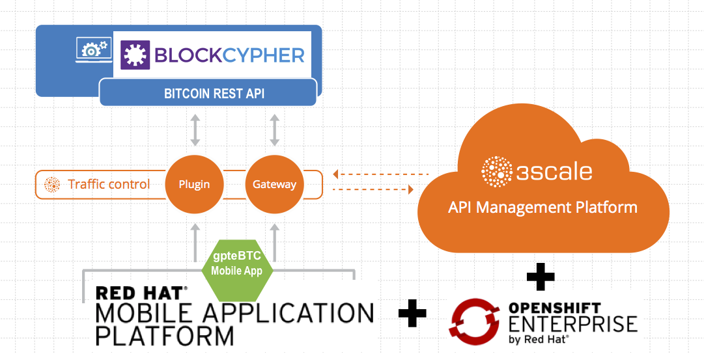
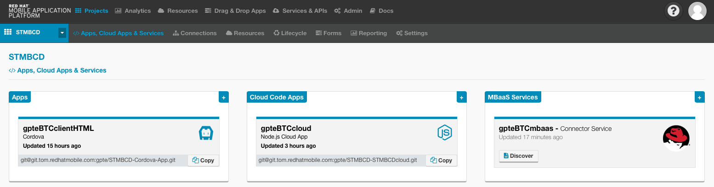
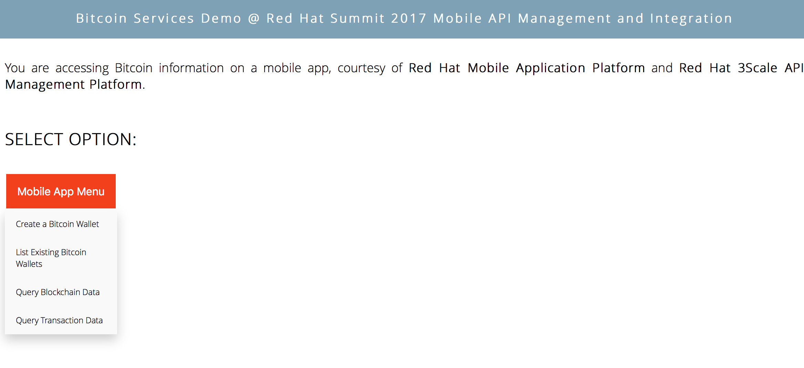
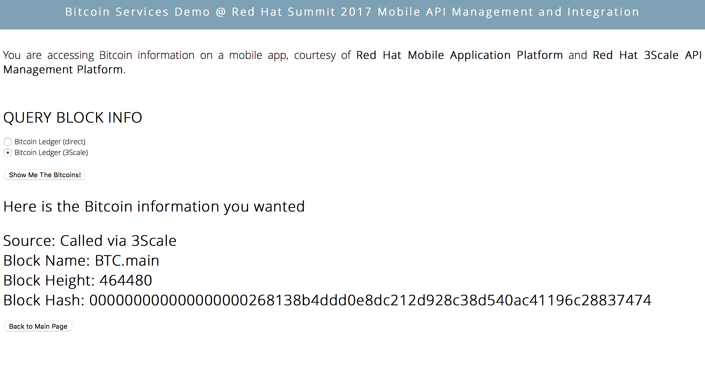
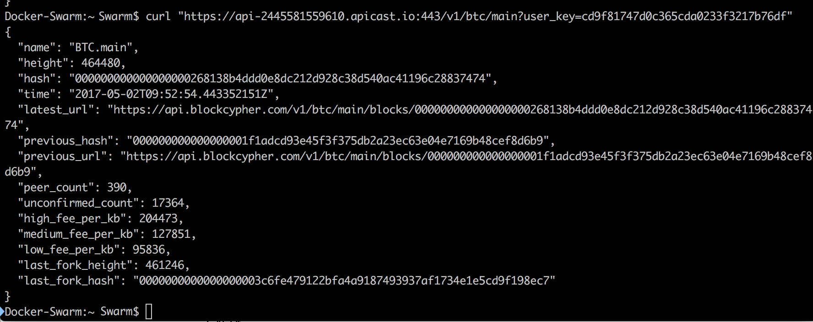
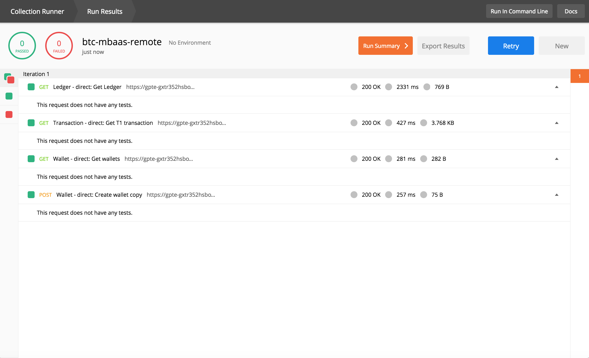

= Setup guide for *gpteBTC* Bitcoin Services Mobile App

:Author:    Hong Hua and Chad Darby
:Contact:   https://github.com/honghuac/gpteBTC/issues/new
:Date:      02.05.2017

:toc: macro

toc::[]

== Software account setup

. Setup two software platform accounts:

* https://www.3scale.net/signup/[Red Hat 3scale API Management Platform]: Bitcoin data API management
* https://openshift.feedhenry.com[Red Hat Mobile Application Platform (RHMAP)]: Mobile application and service hosting and development
+
[NOTE]
These software accounts allow you to begin the deployment of the gpteBTC mobile application to a hosted platform, as well as necessary configuration of both the mobile application and backend API management software.
+
. Login to both platforms.

== Local tooling installation

. Install http://nodejs.org[Node.js] on your workstation. 2 crucial command-line applications will be used for demo of the gpteBTC mobile application: *node* and *npm*.
+
The gpteBTC mobile application is built using Node.js.
+
. Install https://access.redhat.com/documentation/en-us/red_hat_mobile_application_platform_hosted/3/html/local_development_guide/local-development-guide-setting-up-fhc#installing-fhc[FHC]
+
[NOTE]
FHC is the Red Hat Mobile Application Platform command line interface.
It is built using Node.js and exposes all developer functionality of the Red Hat Mobile Application Platform studio.

== Mobile app deployment - on local workstation

The gpteBTC mobile application consists of three components: the cloud app, the client app and the Mobile Backend as a Service(MBaaS) service.
Start both the cloud and client app to begin the demo.

=== Code dependencies installation

. https://access.redhat.com/documentation/en-us/red_hat_mobile_application_platform_hosted/3/html/local_development_guide/local-development-guide-setting-up-fhc#ssh-key-setup[Setup the SSH Key] on your workstation.
+
[NOTE]
On the workstations with MAC-OS or Linux operating systems, you may have to append the `sudo` command to the following commands
+
. Install the Node.js dependencies for both the cloud and client apps.
+
-----
npm install
-----
+
. Install the `grunt` command line tool that will bootstrap the startup process for both the cloud and client apps.
+
-----
npm install -g grunt-cli
-----

=== App startup

. Start the cloud app.
+
-----
grunt serve
-----
+
. Start the client app.
+
-----
grunt serve:local
-----
+
. Your default web browser launches, indicating a successful startup.
. Test the mobile application using your web browser.

[NOTE]
Using FHC for local project development is important, be familiar with the following https://access.redhat.com/documentation/en-us/red_hat_mobile_application_platform_hosted/3/html/local_development_guide/getting-started-fhc[instructions]

== Testing

=== API test

. Test the backend bitcoin API, using `cURL`, a commandline utility for REST and web service testing.
+
-----
curl "https://api-2445581559610.apicast.io:443/v1/btc/main?user_key=cd9f81747d0c365cda0233f3217b76df"
-----
+
. Using the web browser, test the *Query Blockchain Data* function of the gpteBTC mobile app.
+

+
. Compare the results from both tests and notice that the results are identical. This proves that the gpteBTC mobile app was able to query the Bitcoin data API through Red Hat 3scale API Management Platform.
+

=== MBaaS service test

. Obtain a *Postman* https://app.getpostman.com/signup?redirect=web[account]. This is a tool for web and REST service testing.

. Locate the collections found in the Github https://github.com/honghuac/gpteBTC/tree/master/rhmap-demo-postman-collections[repository].

. Import the collections into your *Postman* account, using these https://github.com/honghuac/gpteBTC/tree/master/rhmap-demo-postman-collections[instructions].

. Test the MBaaS service for the gpteBTC mobile app, using the imported https://www.getpostman.com/docs/running_collections[collections].
+

+
. Observe the results of the MBaaS service test, and the HTTP 200 response codes. This indicates that the test for the APIs were successful.

*CONGRATULATIONS! You completed the *gpteBTC* Bitcoin Services mobile application setup.*
